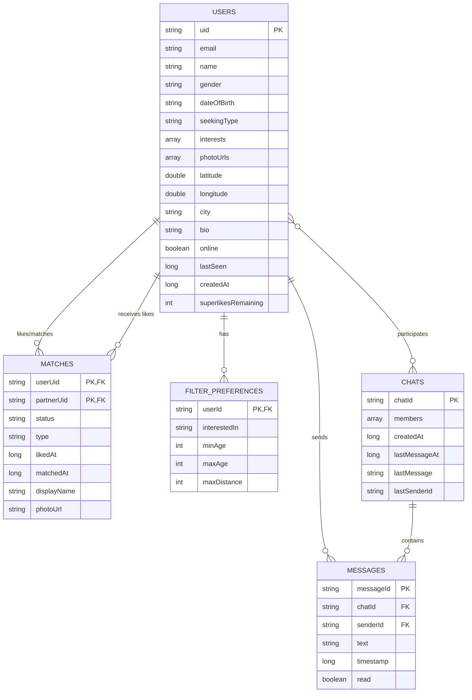

# HeartLink - Entity Relationship Diagram (ERD)

## 📊 Database Schema Overview

HeartLink sử dụng **Firebase Realtime Database** với cấu trúc NoSQL. Dưới đây là ERD tổng thể và mô tả chi tiết các entities.

---

## 🗺️ ERD Diagram (Mermaid)



---

## 📋 Entities Chi Tiết

### **1. USERS** 👤

**Primary Key:** `uid` (String)  
**Description:** Lưu trữ thông tin người dùng

#### **Attributes:**

| Field | Type | Required | Description |
|-------|------|----------|-------------|
| `uid` | String | ✅ | User ID từ Firebase Auth (PK) |
| `email` | String | ✅ | Email đăng nhập |
| `name` | String | ✅ | Họ và tên |
| `gender` | String | ✅ | "male" hoặc "female" |
| `dateOfBirth` | String | ✅ | Ngày sinh (dd/MM/yyyy) |
| `seekingType` | String | ✅ | "friend", "chat", "no_strings", "later" |
| `interests` | Array<String> | ✅ | Danh sách sở thích (keys) |
| `photoUrls` | Array<String> | ✅ | URLs ảnh từ Cloudinary |
| `latitude` | Double | ❌ | Vĩ độ |
| `longitude` | Double | ❌ | Kinh độ |
| `city` | String | ❌ | Thành phố |
| `bio` | String | ❌ | Giới thiệu bản thân |
| `online` | Boolean | ❌ | Trạng thái online |
| `lastSeen` | Long | ❌ | Timestamp lần cuối online |
| `createdAt` | Long | ✅ | Timestamp tạo tài khoản |
| `superlikesRemaining` | Integer | ❌ | Số lượt Superlike còn lại |

#### **Indexes:**
- `uid` (Primary)
- `gender` (Query filter)
- `latitude`, `longitude` (Geo queries)

#### **Relationships:**
- **1:N** với `MATCHES` (as liker)
- **1:N** với `MATCHES` (as liked)
- **M:N** với `CHATS` (thông qua members array)
- **1:N** với `MESSAGES` (as sender)
- **1:1** với `FILTER_PREFERENCES`

---

### **2. MATCHES** 💕

**Composite Primary Key:** `(userUid, partnerUid)`  
**Description:** Lưu trữ quan hệ like/match giữa 2 users

#### **Attributes:**

| Field | Type | Required | Description |
|-------|------|----------|-------------|
| `userUid` | String | ✅ | ID người like (PK1, FK to USERS) |
| `partnerUid` | String | ✅ | ID người được like (PK2, FK to USERS) |
| `status` | String | ✅ | "liked", "matched", "received_like" |
| `type` | String | ✅ | "like" hoặc "superlike" |
| `likedAt` | Long | ✅ | Timestamp khi like |
| `matchedAt` | Long | ❌ | Timestamp khi match (nếu có) |
| `displayName` | String | ❌ | Tên hiển thị (cached) |
| `photoUrl` | String | ❌ | Avatar URL (cached) |

#### **Status Values:**
- `"liked"`: User A đã like User B (one-sided)
- `"received_like"`: User A nhận like từ User B
- `"matched"`: Mutual like (cả 2 đều like nhau)

#### **Type Values:**
- `"like"`: Like thường
- `"superlike"`: Super Like (premium)

#### **Indexes:**
- `(userUid, partnerUid)` (Composite Primary)
- `status` (Query filter)
- `likedAt` (Sort by time)

#### **Relationships:**
- **N:1** với `USERS` (liker)
- **N:1** với `USERS` (liked user)

#### **Example Firebase Path:**
```
/Matches
  /{userUid}
    /{partnerUid}
      - status: "matched"
      - type: "superlike"
      - likedAt: 1732684800000
      - matchedAt: 1732685000000
```

---

### **3. CHATS** 💬

**Primary Key:** `chatId` (String)  
**Description:** Lưu trữ thông tin cuộc trò chuyện

#### **Attributes:**

| Field | Type | Required | Description |
|-------|------|----------|-------------|
| `chatId` | String | ✅ | ID cuộc trò chuyện (PK) |
| `members` | Array<String> | ✅ | Danh sách UIDs (2 members) |
| `createdAt` | Long | ✅ | Timestamp tạo chat |
| `lastMessageAt` | Long | ❌ | Timestamp tin nhắn cuối |
| `lastMessage` | String | ❌ | Nội dung tin nhắn cuối |
| `lastSenderId` | String | ❌ | UID người gửi tin cuối |

#### **ChatId Generation:**
```java
String chatId = uid1.compareTo(uid2) < 0 
    ? uid1 + "_" + uid2 
    : uid2 + "_" + uid1;
```
→ Đảm bảo uniqueness và consistency

#### **Indexes:**
- `chatId` (Primary)
- `members` (Array query)
- `lastMessageAt` (Sort recent chats)

#### **Relationships:**
- **M:N** với `USERS` (thông qua members array)
- **1:N** với `MESSAGES`

#### **Example Firebase Path:**
```
/Chats
  /{chatId}
    - members: ["uid1", "uid2"]
    - createdAt: 1732684800000
    - lastMessageAt: 1732690000000
    - lastMessage: "Hello!"
    - lastSenderId: "uid1"
```

---

### **4. MESSAGES** 💭

**Primary Key:** `messageId` (String)  
**Description:** Lưu trữ tin nhắn trong chat

#### **Attributes:**

| Field | Type | Required | Description |
|-------|------|----------|-------------|
| `messageId` | String | ✅ | ID tin nhắn (PK) - Firebase push key |
| `chatId` | String | ✅ | ID cuộc trò chuyện (FK to CHATS) |
| `senderId` | String | ✅ | UID người gửi (FK to USERS) |
| `text` | String | ✅ | Nội dung tin nhắn |
| `timestamp` | Long | ✅ | Timestamp gửi tin nhắn |
| `read` | Boolean | ❌ | Đã đọc chưa |

#### **Indexes:**
- `messageId` (Primary)
- `chatId` (FK index)
- `timestamp` (Sort messages)

#### **Relationships:**
- **N:1** với `CHATS`
- **N:1** với `USERS` (sender)

#### **Example Firebase Path:**
```
/Chats
  /{chatId}
    /messages
      /{messageId}
        - senderId: "uid1"
        - text: "Hello there!"
        - timestamp: 1732690000000
        - read: false
```

---

### **5. FILTER_PREFERENCES** 🔍

**Primary Key:** `userId` (String)  
**Description:** Lưu trữ bộ lọc tìm kiếm của user

#### **Attributes:**

| Field | Type | Required | Default | Description |
|-------|------|----------|---------|-------------|
| `userId` | String | ✅ | - | UID người dùng (PK, FK to USERS) |
| `interestedIn` | String | ✅ | "both" | "male", "female", "both" |
| `minAge` | Integer | ✅ | 18 | Tuổi tối thiểu |
| `maxAge` | Integer | ✅ | 35 | Tuổi tối đa |
| `maxDistance` | Integer | ✅ | 50 | Khoảng cách tối đa (km) |

#### **Indexes:**
- `userId` (Primary)

#### **Relationships:**
- **1:1** với `USERS`

#### **Storage:**
Lưu trong **SharedPreferences** (local) thay vì Firebase, vì đây là preference cá nhân không cần đồng bộ giữa devices.

---

## 🔗 Relationship Summary

### **Users ↔ Matches**
- **Type:** Many-to-Many (self-referencing)
- **Description:** User có thể like nhiều users, và được nhiều users like
- **Implementation:** 
  ```
  /Matches/{userUid}/{partnerUid}
  ```

### **Users ↔ Chats**
- **Type:** Many-to-Many
- **Description:** User tham gia nhiều chats
- **Implementation:** Thông qua `members` array trong Chats

### **Chats ↔ Messages**
- **Type:** One-to-Many
- **Description:** Một chat chứa nhiều messages
- **Implementation:**
  ```
  /Chats/{chatId}/messages/{messageId}
  ```

### **Users ↔ Messages**
- **Type:** One-to-Many
- **Description:** User gửi nhiều messages
- **Implementation:** `senderId` trong Messages

### **Users ↔ FilterPreferences**
- **Type:** One-to-One
- **Description:** Mỗi user có một bộ filter preferences
- **Implementation:** Local SharedPreferences

---

## 📐 Database Rules & Constraints

### **1. Referential Integrity**

```javascript
// Firebase Security Rules
{
  "rules": {
    "Users": {
      "$uid": {
        ".read": true,
        ".write": "$uid === auth.uid"
      }
    },
    "Matches": {
      "$uid": {
        "$partnerId": {
          ".read": "$uid === auth.uid || $partnerId === auth.uid",
          ".write": "$uid === auth.uid"
        }
      }
    },
    "Chats": {
      "$chatId": {
        ".read": "data.child('members').val().includes(auth.uid)",
        ".write": "data.child('members').val().includes(auth.uid)",
        "messages": {
          "$messageId": {
            ".write": "data.child('members').val().includes(auth.uid)"
          }
        }
      }
    }
  }
}
```

### **2. Data Validation**

#### **Users:**
- `email`: Must be valid email format
- `gender`: Must be "male" or "female"
- `dateOfBirth`: Must be dd/MM/yyyy format
- `interests`: Array of valid interest keys
- `photoUrls`: Minimum 1 photo required

#### **Matches:**
- `status`: Must be one of ["liked", "matched", "received_like"]
- `type`: Must be one of ["like", "superlike"]
- Cannot match with self (userUid ≠ partnerUid)

#### **Chats:**
- `members`: Must contain exactly 2 UIDs
- Both members must exist in Users table

#### **Messages:**
- `text`: Cannot be empty
- `senderId`: Must be one of the chat members

---

## 🔄 Data Flow Diagrams

### **Like → Match Flow**

```
USER A swipes right on USER B
        ↓
Create/Update Match record:
  /Matches/A/B
    - status: "liked"
    - type: "like"
    - likedAt: timestamp
        ↓
Check if B already liked A:
  /Matches/B/A exists?
        ↓
  YES → Update both records:     |    NO → End
    /Matches/A/B                 |
      - status: "matched"        |
      - matchedAt: timestamp     |
    /Matches/B/A                 |
      - status: "matched"        |
      - matchedAt: timestamp     |
        ↓                        |
  Create Chat:                   |
    /Chats/{chatId}              |
      - members: [A, B]          |
        ↓                        |
  Show MatchSuccessActivity      |
```

### **Message Flow**

```
USER A sends message to USER B
        ↓
Get/Create Chat:
  chatId = min(A,B) + "_" + max(A,B)
        ↓
Write Message:
  /Chats/{chatId}/messages/{pushKey}
    - senderId: A
    - text: "Hello"
    - timestamp: now
        ↓
Update Chat metadata:
  /Chats/{chatId}
    - lastMessage: "Hello"
    - lastMessageAt: now
    - lastSenderId: A
        ↓
Trigger notification to USER B
```

---

## 📊 Data Statistics

### **Estimated Storage (per 1000 users):**

| Entity | Avg Size/Record | Records/User | Total Size |
|--------|----------------|--------------|------------|
| Users | ~2 KB | 1 | ~2 MB |
| Matches | ~500 bytes | 50 | ~25 MB |
| Chats | ~300 bytes | 20 | ~6 MB |
| Messages | ~200 bytes | 500 | ~100 MB |
| **TOTAL** | - | - | **~133 MB** |

### **Query Patterns:**

1. **Discovery Query:**
   - Filter by: gender, age range, distance
   - Exclude: already liked/matched users
   - Limited: 50 results

2. **Matches Query:**
   - User's matches where status = "matched"
   - Ordered by: matchedAt DESC
   - Real-time listener

3. **Messages Query:**
   - Chat's messages
   - Ordered by: timestamp ASC
   - Real-time listener
   - Paginated: 50 messages/load

---

## 🎯 Indexing Strategy

### **Firebase Indexes:**

```json
{
  "rules": {
    "Users": {
      ".indexOn": ["gender", "latitude", "longitude", "createdAt"]
    },
    "Matches": {
      ".indexOn": ["status", "likedAt", "matchedAt"]
    },
    "Chats": {
      ".indexOn": ["lastMessageAt"]
    }
  }
}
```

### **Benefits:**
- ✅ Fast gender filtering
- ✅ Efficient geo-queries
- ✅ Quick match status lookups
- ✅ Sorted chat/message lists

---

## 🔒 Privacy & Security

### **Data Access Control:**

| Entity | Read | Write | Delete |
|--------|------|-------|--------|
| Users | Public (limited fields) | Owner only | Owner only |
| Matches | Owner + Partner | Owner only | Owner only |
| Chats | Members only | Members only | None |
| Messages | Chat members | Sender only | None |

### **Sensitive Data:**
- ❌ **Never Exposed:** Email, exact location
- ✅ **Public:** Name, photos, bio, interests
- 🔐 **Conditional:** Online status, last seen

---

## 📈 Scalability Considerations

### **Current Limitations:**
1. Firebase Realtime DB: Max 200k concurrent connections
2. Single global instance (can shard by region if needed)

### **Future Optimizations:**
1. **Sharding:** Split users by region
2. **Caching:** Redis for hot data
3. **CDN:** Cloudinary for images
4. **Analytics:** BigQuery export for insights

---

**Document Version:** 1.0  
**Last Updated:** November 27, 2025  
**Database:** Firebase Realtime Database
